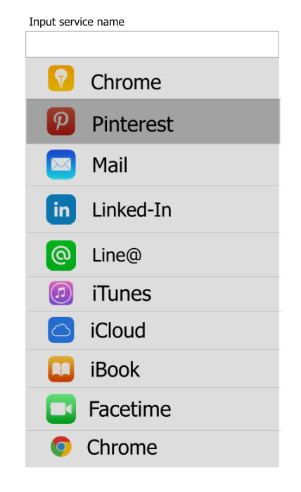

# Prerequisites

1.  Pure js implementation without any libraries or frameworks is strongly recommended.
2.  It should be bug‐free on latest Chrome(PC), which also means you can use latest js spec if supported.
3.  CSS preprocessor is strongly recommended.
4.  Must use git for your commit.
5.  Clear annotations are strongly recommended.
6.  Pack your final work as .zip file, which should contain: 
- All source code
- A demo html page, which should work without extra setting
- .git meta file, for us to see your commit log
- A clear README

Notes: Please devote enough time on this to impress us with your skill.

# Overview
There are many apps in Apple Sotre, please implement a suggest plugin for easier input of app names. Something like following but do make it as cool as you can.

# Requirements
1.  Be able to attach to multiple input by js.
2.  Suggest layer should be displayed when input is focused, and hidden when areas outside are clicked.
3.  Show all the matching items(if no input, show all the apps), with logo & name, at max height 400px.
4.  Clicking item(or pressing ENTER key when item is focused) should update the input field with corresponding app name.
5.  Should support both keyboard & mouse selecting for PC browsers, and there must be no conflict when using both. 

# Bonus point
1.  Update suggest layer with minimum dom operations rather than simply replacing the whole dom.
2.  Handle click event by event delegation, .etc
3.  Make it extensible for other data source and template supports mobile browsers, such as iOS Safari. 
4.  Should save input history when suggested item is selected. Manage input history in local browser(localStorage, indexDB, .etc) display history items with higher priority should enable user to clear special search history item.
